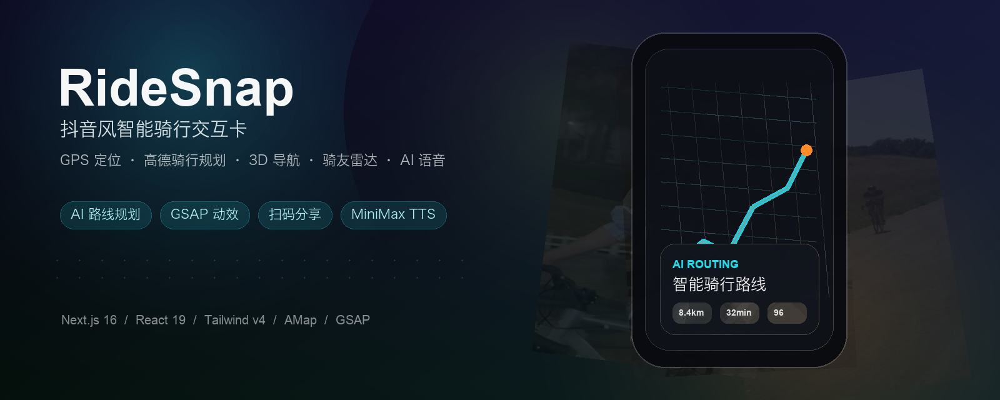

# RideSnap 智能骑行卡



> 抖音风智能骑行交互卡演示项目：从骑行视频流出发，完成 AI 场景识别、目的地选择、真实骑行路线规划、3D 地图导航、附近骑友雷达、装备推荐、挑战榜和扫码分享。

`v0.3.0` 聚焦体验升级：目的地选择器、AI 路线规划加载态、卡片交互和路线导航都加入了更完整的 GSAP 动效与 AI 风格反馈。

## Highlights

- **沉浸式抖音外壳**：状态栏、顶部 tab、右侧动作栏、底部 nav、视频背景和 caption 组成完整手机端演示界面。
- **真实地图链路**：浏览器 GPS 定位、高德 regeo、inputtips、周边 POI、骑行路线、天气、JS API 2.0 3D 地图和实时路况层。
- **AI 路线卡片**：目的地选择、路线指标、安全提示、骑行导航、AI 问答、路线调优和高德 App 跳转。
- **更丝滑的交互动画**：GSAP 驱动弹层进退场、列表错峰、雷达扫描、规划中打字机、路线扫描光束和卡片视差切换。
- **语音导航**：MiniMax TTS / 语音克隆优先，浏览器 SpeechSynthesis 自动兜底。
- **社交与商业闭环**：附近骑友雷达、约骑邀请、装备优选、挑战榜、分享面板和二维码。

## Demo Flow

1. 刷到骑行视频，点击 `AI 识别附近骑行赛道`。
2. 应用获取 GPS，并用高德反向地理编码识别当前城市/街道。
3. 在目的地弹层搜索公园、绿道、景区或自行车店，也可以选择附近热门骑行点。
4. AI 路线规划面板展示打字机状态、扫描路线节点和策略进度。
5. 路线完成后进入 3D 地图，查看距离、时长、天气、安全评分和步骤导航。
6. 切换到骑友雷达、装备优选、挑战榜，最后用二维码分享现场演示页。

## Tech Stack

| Area | Stack |
|---|---|
| Framework | Next.js 16.2.6, App Router, Turbopack |
| UI | React 19, Tailwind CSS v4, antd 6 |
| Animation | GSAP 3 |
| Map | 高德 Web 服务 API, 高德 JS API 2.0 |
| Voice | MiniMax TTS / Voice Clone, Web Speech API fallback |
| Data | Next Route Handlers, in-memory cache, mock social/shop datasets |
| Language | TypeScript 5 |

## Core Features

### RouteCard 智能路线

- `navigator.geolocation` 获取真实起点，失败时回退到演示坐标。
- 高德 `regeo` 识别城市和街道，高德 `bicycling` 生成骑行路线。
- 3D 地图默认俯瞰视角，支持路况层、起终点 marker、路线 polyline 和跟随航向。
- AI 助手根据路线、天气、安全评分和导航进度回答“前面堵不堵”“附近有补给吗”“换安全路线”等问题。
- 规划中状态升级为 AI 风格动效面板，包含打字机文案、路线扫描和策略进度。

### DestinationPicker 目的地选择

- 支持“骑行相关”和“全部地点”两种搜索范围。
- 输入 debounce 500ms，并用 AbortController 取消过期请求。
- 空状态会拉取附近 5km 热门骑行 POI。
- 支持一键环线：起终点都设为当前位置。
- 弹层、筛选、搜索结果和列表项都有轻量 GSAP 动效。

### Buddy / Shop / Challenge / Share

- 骑友雷达用本地骑行头像和 mock 数据模拟附近骑友，支持点头像约骑。
- 装备卡按城市/山地场景推荐头盔、整车、配件和服饰。
- 挑战榜支持里程、爬升、均速维度。
- 分享面板生成现场演示二维码，优先使用局域网 URL。

## Quick Start

```bash
npm install
cp .env.example .env.local
npm run dev
```

打开 `http://localhost:3000`，浏览器允许定位权限后即可体验完整链路。

生产构建：

```bash
npm run lint
npm run build
```

## Environment Variables

`.env.local` 示例：

```bash
AMAP_WEB_KEY=
NEXT_PUBLIC_AMAP_JS_KEY=
NEXT_PUBLIC_AMAP_JS_SECURITY=

MINIMAX_API_KEY=
MINIMAX_API_HOST=https://api.minimax.io
MINIMAX_VOICE_ID=
MINIMAX_TTS_MODEL=speech-2.8-turbo

NEXT_PUBLIC_DEMO_URL=
```

| Variable | Required | Purpose |
|---|---:|---|
| `AMAP_WEB_KEY` | Recommended | 服务端调用高德 Web 服务 API：regeo / inputtips / bicycling / place / weather / district |
| `NEXT_PUBLIC_AMAP_JS_KEY` | Recommended | 前端加载高德 JS API 2.0 并渲染真实 3D 地图 |
| `NEXT_PUBLIC_AMAP_JS_SECURITY` | Recommended | 高德 JS API 2.0 安全密钥 |
| `MINIMAX_API_KEY` | Optional | MiniMax TTS / 语音克隆 |
| `MINIMAX_VOICE_ID` | Optional | 导航播报音色 ID |
| `NEXT_PUBLIC_DEMO_URL` | Optional | 分享二维码使用的公网或局域网演示地址 |

未配置 key 也可以启动：地图、路线和语音会降级到空状态、mock 坐标或浏览器 TTS。

## MiniMax Voice Clone

启动本地服务后，可以用音频样本创建导航音色：

```bash
curl -X POST http://localhost:3000/api/voice/minimax/clone \
  -F "file=@/path/to/sample.mp3" \
  -F "voice_id=ridesnap_nav_voice"
```

把返回的 `voiceId` 写入 `.env.local`：

```bash
MINIMAX_API_KEY=your_api_key
MINIMAX_VOICE_ID=ridesnap_nav_voice
```

接口不可用时，应用会自动回退到浏览器中文语音播报。

## Project Structure

```text
app/
├── api/
│   ├── ai/                  # Ride assistant API
│   ├── amap/                # 高德服务端代理
│   ├── demo-url/            # 分享二维码 URL
│   └── voice/               # MiniMax TTS / clone
├── components/
│   ├── atoms/               # CardShell, ControlChip, Header, Toast
│   ├── cards/               # Route, Buddy, Gear, Challenge, Share, Picker
│   ├── douyin/              # 抖音外壳
│   └── scene/               # 视频场景、控制面板、二维码面板
├── lib/
│   ├── amap.ts              # 高德请求、缓存和兜底路线
│   ├── geo.ts               # Geolocation + regeo
│   ├── ride-ai.ts           # AI assistant client
│   ├── voice-nav.ts         # TTS orchestration
│   └── use-card-deck.ts     # 卡片切换视差 hook
└── ridesnap-demo.tsx        # Demo 状态机和页面组合

public/
├── posters/                 # 热门视频封面
├── readme/                  # GitHub README assets
├── riders/                  # 骑友头像
└── videos/                  # 演示视频素材
```

## Release Notes

### v0.3.0

- 升级目的地弹层排版、搜索框、筛选按钮和 POI 列表密度。
- 为目的地弹层加入 GSAP 进场、关闭、列表错峰和点击反馈。
- 重做“正在为你规划路线”加载态，加入 AI 风格路线扫描、策略进度和打字机效果。
- 新增装备、挑战、热门视频、分享二维码、AI 助手和 MiniMax 语音相关模块。
- 增加 README 横幅和更完整的项目文档。

### v0.2.2

- 正经 3D 驾驶视角导航。

### v0.2.1

- 实时导航与稳定性修复。

### v0.2.0

- 接入真实高德 API，完成模块化拆分和语音导航。

## Notes

这是一个 Hackathon MVP / 产品原型项目，用于验证“刷到骑行视频 → 真实规划路线 → 找骑友 → 分享转化”的交互链路。骑友、商品、挑战榜和部分热门视频数据为本地演示数据，不代表真实业务能力。

高德地图数据和 SDK 使用需遵守高德开放平台服务条款。请不要提交 `.env.local` 或任何真实 API Key。
